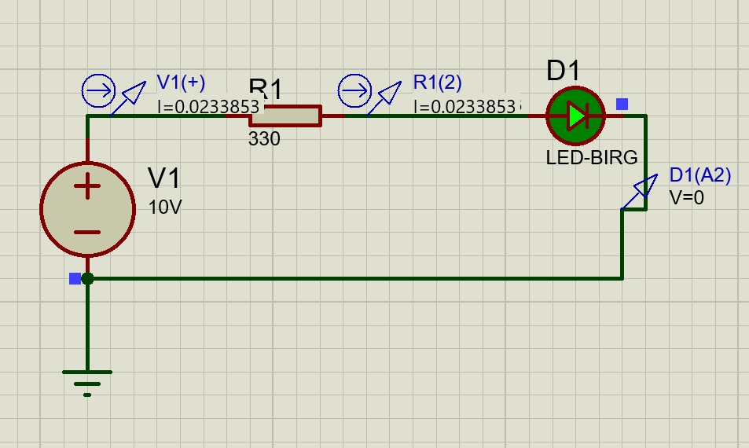

# proteus-dc-simulation-basic
Proteus üzerinde DC devre analizi, SPICE modelleme ve temel LED sürücü devresi simülasyonu.
# Proteus Basic DC Circuit Analysis and LED Driver Simulation

This study was carried out to examine the differences between analog and digital simulation models in the Proteus ISIS environment, perform DC circuit analysis, and verify circuit theory using current/voltage probes.

Circuit Schematic

Technical Analysis and Theoretical Calculation

A 10V DC source, a current-limiting resistor (330 Ω), and an analog blue LED model (LED-BIRG) were used in the circuit.

Circuit Analysis with Ohm's Law
- Source Voltage ($V_1$): 10V
- Series Resistor ($R_1$): 330 Ω
- LED Forward Voltage ($V_f$): ~2.28V (Analog SPICE model data)

Voltage drop across the resistor ($V_{R1}$):
$$V_{R1} = V_1 - V_f = 10\text{V} - 2.28\text{V} = 7.72\text{V}$$

Theoretical current expected to pass through the circuit:
$$I = \frac{7.72\text{V}}{330\ \Omega} \approx 0.02339\text{A} \ (23.39\text{ mA})$$

Simulation Results
In the DC analysis performed on Proteus, the current measured via current probes was verified as 23.38 mA. The theoretical calculation and simulation results match with 99.9% accuracy.

Simulation Outputs and Key Takeaways

- Reference Point (GND): It was observed that when a ground (GND) is not added to the circuit diagram, the simulation engine cannot find a reference point and calculates the voltage values incorrectly. A GND connection is mandatory for a stable simulation.

- Digital vs. Analog Model Difference: When the LED element is left in "Digital" mode, it behaves like a logic gate that draws no current. It has been determined that the element must be run with Analog SPICE parameters for accurate current flow and realistic voltage division.

- Series Resistance Effect: I experienced that LEDs have an internal resistance (Series Resistance) resulting from their production structure, and this value (e.g., 1-5 Ω) directly affects current calculations by adding to the total circuit resistance.

- Insulation Resistance (Off Resistance) Limit: The importance of the Off Resistance value defined for cases where the LED is in cutoff (not conducting current) was realized. It was observed that if this value is entered too low in the simulator, it causes simulation errors by letting current leak even when the element is off.

- Reverse Breakdown Voltage: The effect of the Breakdown Voltage parameter, which represents the maximum reverse voltage limit the LED can withstand when reverse bias is applied, on the stability of the simulation was examined.

- Unit Definitions: The importance of case sensitivity in the simulator (the requirement to use 1MEG instead of 1M for Megaohm) was experienced.

How to Run?
1. Ensure Proteus 8.x or a higher version is installed on your computer.
2. Download the .pdsprj project file from the repository.
3. Open the project and click the Play button in the bottom left corner to start the simulation.

 
